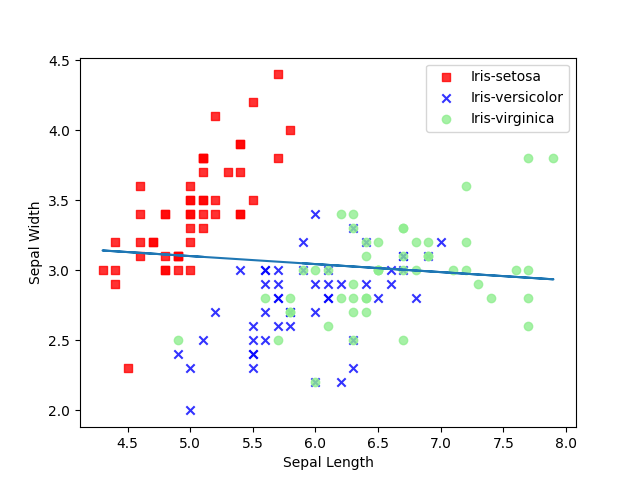
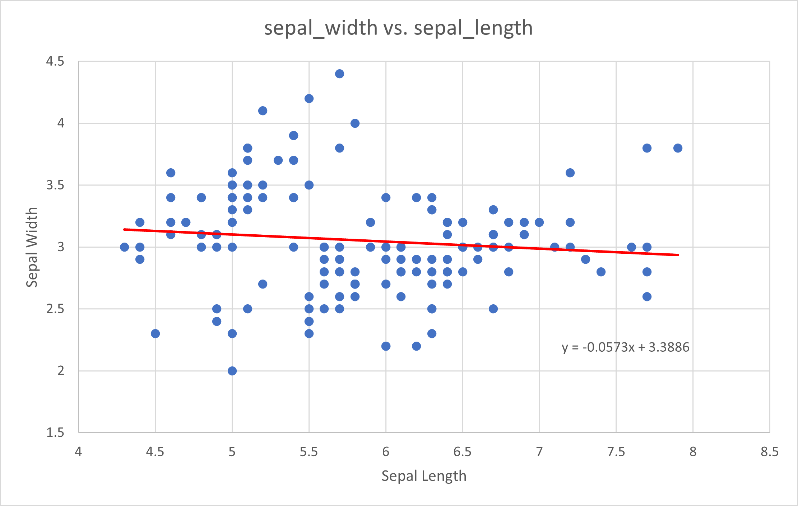
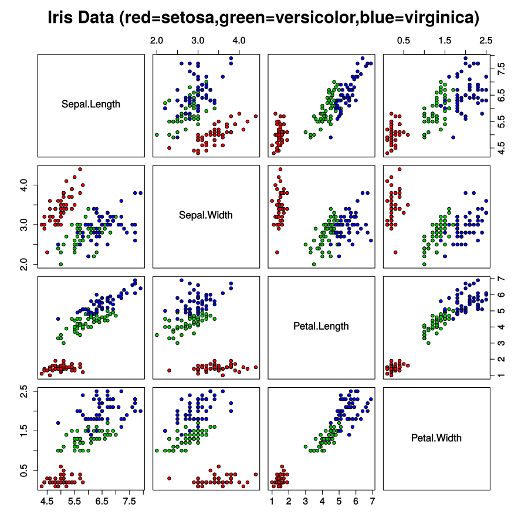
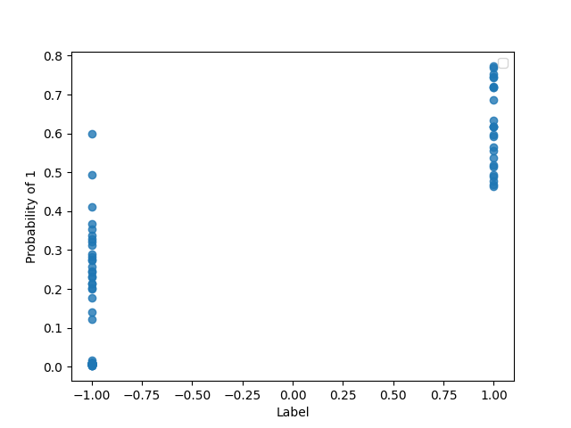
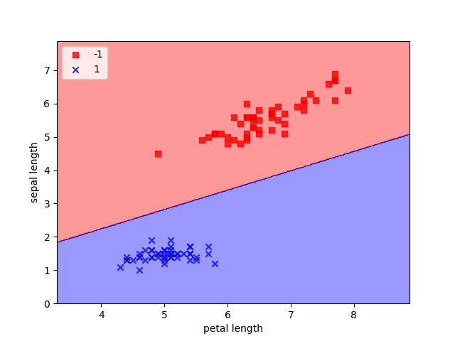

# ML Portfolio
---

 Tim Adcock

## Perceptron
The ML.py contains a perceptron for supervised learning of binary classifiers.
f
To load the perceptron into the python file you plan on using it in simply import it from ML.py, make sure you have ML.py in the same folder as the file you want to import it to.

Example:
```Python
from ML import Perceptron
```

To run the perceptron
1.	Create the object
2.	Fit the desired data
3.	Predict desired data

Example:<br>
```Python
pn = Perceptron(.01 10)
pn.fit(X,y)
predicted = pn.predict(Z)
```


<br>

The data must be in the from:
```Python
[[5.1, 1.4 ,..]
 [4.9, 1.4, ...]
 [4.7, 1.3, ...]
 [4.6, 1.5, ...]
 [5., 1.4, ...]...]
```

The classified data (y) must be in the form:
```Python
[-1, -1, 1, 1, ...]
```

Where X[0] is the data that relates to y[0].

The first argument for the perceptron (.01) is the learning rate of the perceptron, the second argument (10) is the max number of iterations the perceptron will run through given it does not converge before that. The Perceptron works by predicting each observation through a starting weight, getting the error from that prediction and then multiply the learning rate, then add in that new term back into the weights.<br>

$$d_w = rate * (x_a - x_p)$$
$$weights = weights + (d_w * x)$$

The starting weight that corresponds to $x^0$ is simply the $d_w$ term added into it.

The predict function uses the data in the same format as $X$.<br>

I tested it on the IRIS dataset. I found that the setosa are very different from the other two, so they are easily differentiated. Depending on the attributes chosen the perceptron will converge usually before 10 iterations when looking at setosa and either one or both versicolor and virginica. When looking at versicolor and virginica they are similar enough that it takes a long time for them to converge if at all (I ran 100000 iterations and it did not converge).

If running the perceptron without calling the plot_decision_regions or any print statements, then nothing will be outputted. Make Sure if calling plot_decision_regions it will only work if the data contains 2 variables for the points. plot_decision_regions takes 5 argument X, y, classifier, labels and resolution. Resolution is optional. X and y are the same as Perceptron.predict(X,y) and labels are the x and y axis labels in that order.

If ran correctly the output from plot_decision_regions should look like:


```Python
from ML import Perceptron
import pandas as pd, numpy as np, matplotlib.pyplot as plt

df = pd.read_csv('https://archive.ics.uci.edu/ml/machine-learning-databases/IRIS/IRIS.data', header=None)


y = df.iloc[50:150, 4].values

y = np.where(y == 'Iris-virginica', -1, 1)

X = df.iloc[50:150, [0,2]].values


pn = Perceptron(.01, 1000)

pn.fit(X, y)

X = df.iloc[0:50, [0,2]].values
X = np.concatenate((X,df.iloc[100:150, [0,2]].values))

y = df.iloc[0:50, 4].values
y = np.concatenate((y,df.iloc[100:150, 4].values))
y = np.where(y == 'IRIS-setosa', -1, 1)

from ML import plot_decision_regions
plot_decision_regions(X,y,pn,('petal length','sepal length'))
```
### How it Works
The perceptron predicts by taking a dot product of the weights found from fitting and the given data, adding in the bias. This number is then compared to 0, if it is greater than 0 the prediction is a 1 otherwise it is -1. To train a perceptron you need a training rate which is how much an error is taken into account. Next the number if iterations which is how many times the perceptron will iterate through the data. We start out with a zero weight vector. Then we can take the data to be trained on and iterate through it, we create a $δ_w$ which is the rate multiplied with the error of a prediction with the data. To correct this error, multiply the $δ_w$ with that particular data then add that to the weights, to update the bias just add the $δ_w$ to the bias.

## Linear Regression
The ML.py contains a Linear Regression model.

To load the Linear Regression into the python file you plan on using it in simply import it from ML.py, make sure you have ML.py in the same folder as the file you want to import it to.

Example:
```Python
from ML import LinearRegression
```

To run the Linear Regression
1.	Create the object
2.	Fit the desired data
3.	Predict desired data

Example:<br>
```Python
pn = LinearRegression()
pn.fit(X,y)
plot_regression_line(X,y,pn,"Sepal Length","Sepal Width")
```


<br>

The X data must be in :
```Python
[[5.1]
 [4.9]
 [4.7]
 [4.6]
 [5.]...]
```

The y data must be in the form:
```Python
[3.5, 3., 3.2, 3.1, 3.6, 3.9, 3.4, ...]
```

Where X[0] is the data that relates to y[0].

The Linear Regression does not take any parameters. The Linear Regression used the equation $β = (X^TX)^{-1}y$ to obtain the β  values. Since we can not guarantee That X is inversible we use the pseudo inverse creating a close enough solution. I chose this equation rather than using the summation method since this way I could expand it to use multiple variables. I tried to test it using multiple variables but the restriction is my graphing function. <br>

I tested this using the IRIS dataset. I compared my algorithm with Excels and found that the two algorithms are very close.



with weights:
 ```Python
[ 3.38863738 -0.05726823]
```
where the first number corresponds with the intercept and the second the weight given to the Sepal Length.

Excel regression:


This is from the following code:

```Python
from ML import Perceptron, LinearRegression, DecisionStump, plot_decision_regions, plot_regression_line
import pandas as pd, numpy as np, matplotlib.pyplot as plt

df = pd.read_csv('https://archive.ics.uci.edu/ml/machine-learning-databases/iris/iris.data', header=None)

linY = df.iloc[0:150, 4].values
linX = df.iloc[0:150, [0,1]].values

pn = LinearRegression()
pn.fit(linX[:,:-1],linX[:,-1])
plot_regression_line(linX[:,0],linX[:,-1],linY,pn,"Sepal Length","Sepal Width")
```
The first variable in linX is the X variable and the second is the Y.

### How it works
A prediction in the linear regressor is done with taking the dot product of the data being predicting with the weight vector. To train the linear regressor, once the data is sent in, a new column is added that represents the intercept variable, then a pseudo inverse is generated then a dot product with the labels. This solves the equation $β = (X^TX)^{-1}y$.

## Decision Stump
The ML.py contains a Decision Stump model.

To load the Decision Stump into the python file you plan on using it in simply import it from ML.py, make sure you have ML.py in the same folder as the file you want to import it to.

Example:
```Python
from ML import DecisionStump
```

To run the Decision Stump
1.	Create the object
2.	Fit the desired data
3.	Predict desired data

Example:<br>
```Python
pn = DecisionStump()
pn.fit(decX,decY)
pn.predict(decX)
```
<br>

The X data must be in :
```Python
[[5.1, 1.4 ,..]
 [4.9, 1.4, ...]
 [4.7, 1.3, ...]
 [4.6, 1.5, ...]
 [5., 1.4, ...]...]
```

The classified data (y) must be in the form:
```Python
[-1, -1, 1, 1, ...]
```

X Where X[0] relates to y[0]

There are no arguments on creation of a Decision Stump. The decision stump iterates through all the variables of the observations obtaining new thresholds (θ), the variable that produced it (j) and the label that it is checking for (s). After training, the model will contain the θ which is the threshold being used, the variable to be used, and the classification (-1 or 1) that lead to this threshold variable combo.

I tested this on the IRIS dataset, I started with one variable and slowly iterated it through them all. I found that When testing for versicolor or setosa and leaving virginica out, I found that virginica would lead to none of the results being correct, the same thing happened with versicolor, but this did not happened with setosa. This can be explained since setosa is very different from versicolor and virginica.




[I got this here](https://upload.wikimedia.org/wikipedia/commons/5/56/Iris_dataset_scatterplot.svg)


```
Threshold:  4.800000000000001
Variable:  2
Classification:  1
Errors:  4
```

Was obtained from the following code:

```Python
from ML import Perceptron, LinearRegression, DecisionStump, plot_decision_regions, plot_regression_line, plot_scatter
import pandas as pd, numpy as np, matplotlib.pyplot as plt

df = pd.read_csv('https://archive.ics.uci.edu/ml/machine-learning-databases/iris/iris.data', header=None)

#Decision Stump
decX = df.iloc[0:25, [0,1,2,3]].values
decX = np.concatenate((decX,df.iloc[50:75, [0,1,2,3]].values))
decX = np.concatenate((decX,df.iloc[100:125, [0,1,2,3]].values))

decY = df.iloc[0:25, 4].values
decY = np.concatenate((decY,df.iloc[50:75, 4].values))
decY = np.concatenate((decY,df.iloc[100:125, 4].values))
decY = np.where(decY == 'Iris-virginica', 1, -1)

decTX = df.iloc[25:50, [0,1,2,3]].values
decTX = np.concatenate((decTX,df.iloc[75:100, [0,1,2,3]].values))
decTX = np.concatenate((decTX,df.iloc[125:150, [0,1,2,3]].values))

decTY = df.iloc[25:50, 4].values
decTY = np.concatenate((decTY,df.iloc[50:75, 4].values))
decTY = np.concatenate((decTY,df.iloc[100:125, 4].values))
decTY = np.where(decTY == 'Iris-virginica', 1, -1)

pn = DecisionStump()
pn.fit(decX,decY)
pred = pn.predict(decTX)
cnt = 0
for i in range(len(pred)):
    if pred[i] != decTY[i]:
        cnt += 1

print("Threshold: ", pn.theta)
print("Variable: ", pn.j)
print("Classification: ", pn.s)
print("Errors: ", cnt)
```

### How it Works
To predict in a Decision Stump, the data is take and then subtracted with a threshold that is generated through training, then the sign of that result multiplied with a s variable that is generated through training as well. To train using a decision stump, after entering the data the algorithm will iterate through all variables and elements and label types in the data. The firs thing in a specific iteration is that a threshold is generated through that element then that threshold is tested by predicting the training data, if that threshold gives a lower error then that threshold is kept.

## Logistical Regression
The ML.py contains a Logistical Regression model.

To load the Logistical Regression into the python file you plan on using it in simply import it from ML.py, make sure you have ML.py in the same folder as the file you want to import it to.

Example:
```Python
from ML import LogisticalRegression
```

To run the Logistical Regression
1.	Create the object
2.	Fit the desired data
3.	Predict desired data

Example:<br>
```Python
pn = LogisticalRegression()
pn.fit(logX,logY)
probs = pn.predict(logTX)
```


<br>

The X data must be in :
```Python
[[5.1]
 [4.9]
 [4.7]
 [4.6]
 [5.]...]
```

The y data must be in the form:
```Python
[3.5, 3., 3.2, 3.1, 3.6, 3.9, 3.4, ...]
```

Where X[0] is the data that relates to y[0].

Logistical Regression takes a model that has weights used in it, by default it uses the Perceptron but Linear Regression can also be used. Logistical Regression uses the model given to obtain weight values to be used with a sigmoid function of $\frac{1}{1+e^{-y_i}}$. Since Logistical Regression is designed to output probabilities the predict function will only give said probabilities based on the data trained on where the closer to 1 the probability is the more l likely the element is labeled as a 1.<br>

I received the output:
```
0.008195018719948858
0.00810127141321623
0.004375279484547917
0.004070137715896009
0.010036893720955075
0.009561529886062441
0.004659392142173908
0.0027803340230225597
0.0018687780211071598
0.006782526324549394
0.004355286872926951
0.002453948389089791
0.006782526324549394
0.010487793955541974
0.005152025488282466
0.00465475675644794
0.01565786789962445
0.009357273461472342
0.009504876124933417
0.0085435365433032
0.008716351270985407
0.004663103758553045
0.00861840062546146
0.003507982650956792
0.005329256692558352
0.1760705703563017
0.24593709519646997
0.3680945369763285
0.35288084329820807
0.123164342682359
0.24335001083674898
0.20197435494016244
0.1998231564547226
0.5985434951329421
0.49390030262330964
0.31324327335609176
0.230161414270103
0.28300587288110113
0.2734477180185818
0.3289804380039476
0.4112016592783524
0.32086488138494895
0.2315463819201585
0.21345901243621274
0.33755702940092047
0.25673656833162484
0.28987319169526443
0.21436704426392167
0.14097687168478787
0.2751596398360304
0.5554707264523272
0.4892016793025947
0.5195899667855897
0.7527624330194801
0.4647585326063942
0.6176534161463839
0.4676950645476266
0.7725559220167235
0.47816389829234995
0.6862402027573542
0.6182672379847226
0.7689869860909073
0.6182672379847244
0.5136965725585966
0.5367336956208875
0.7209140254836917
0.4938503101257235
0.7192612253602723
0.7438354824706404
0.7452429639182606
0.5930045341193257
0.5969565601864026
0.5649804116168297
0.7189784442812883
0.6345994816941098
Logistical Regression Error:  6
```




This is from the following code:

```Python
#Logisitcal Regression
logX = df.iloc[0:25, [0,1,2,3]].values
logX = np.concatenate((logX,df.iloc[50:75, [0,1,2,3]].values))
logX = np.concatenate((logX,df.iloc[100:125, [0,1,2,3]].values))

logY = df.iloc[0:25, 4].values
logY = np.concatenate((logY,df.iloc[50:75, 4].values))
logY = np.concatenate((logY,df.iloc[100:125, 4].values))
logY = np.where(logY == 'Iris-virginica', 1, -1)

logTX = df.iloc[25:50, [0,1,2,3]].values
logTX = np.concatenate((logTX,df.iloc[75:100, [0,1,2,3]].values))
logTX = np.concatenate((logTX,df.iloc[125:150, [0,1,2,3]].values))

logTY = df.iloc[25:50, 4].values
logTY = np.concatenate((logTY,df.iloc[50:75, 4].values))
logTY = np.concatenate((logTY,df.iloc[100:125, 4].values))
logTY = np.where(logTY == 'Iris-virginica', 1, -1)

pn = LogisticalRegression()
pn.fit(logX,logY)
probs = pn.predict(logTX)
err = 0
for i in range(len(probs)):
    if np.where(probs[i] >= .5,1,-1) != logTY[i]:
        err += 1

print("Logistical Regression Error: ", err)
plot_scatter(logTY, probs)
```
logX is the training X and LogY is the training Y, while logTX and logTY are the testing X and Y.

### How it works
After choosing either the Perceptron or Linear Regression, Logistical Regression will run the model given to obtain weights. These weights will then be used to obtain a $y_i$ following $y_i=<W,x_i>$. This $y_i$ will then be put into the sigmoid function $p=\frac{1}{1+e^{-y_i}}$. $p$ now equals the probability of $x_i$ of being $1$.


## Threshold
The ML.py contains a Threshold model.

To load Threshold into the python file you plan on using it in simply import it from ML.py, make sure you have ML.py in the same folder as the file you want to import it to.

Example:
```Python
from ML import Threshold
```

To run the Threshold
1.	Create the object
2.	Fit the desired data
3.	Predict desired data

Example:<br>
```Python
pn = Threshold()
pn.fit(thrX,thrY)
preds = pn.predict(thrTX)
```


<br>

The X data must be in :
```Python
[[5.1]
 [4.9]
 [4.7]
 [4.6]
 [5.]...]
```

The y data must be in the form:
```Python
[3.5, 3., 3.2, 3.1, 3.6, 3.9, 3.4, ...]
```

Where X[0] is the data that relates to y[0].

Threshold takes a model that has weights used in it, by default it uses the Perceptron but Linear and Logistical Regressions can also be used. Threshold is a combination of Decision Stump and another model. The main goal of Threshold is to use a models prediction to generate a threshold to compare future tests to.<br>

I received the output:
```
Threshold error using Perceptron:  3
```


This is from the following code:

```Python
#Threshold
thrX = df.iloc[0:25, [0,1,2,3]].values
thrX = np.concatenate((thrX,df.iloc[50:75, [0,1,2,3]].values))
thrX = np.concatenate((thrX,df.iloc[100:125, [0,1,2,3]].values))

thrY = df.iloc[0:25, 4].values
thrY = np.concatenate((thrY,df.iloc[50:75, 4].values))
thrY = np.concatenate((thrY,df.iloc[100:125, 4].values))
thrY = np.where(thrY == 'Iris-virginica', 1, -1)

thrTX = df.iloc[25:50, [0,1,2,3]].values
thrTX = np.concatenate((thrTX,df.iloc[75:100, [0,1,2,3]].values))
thrTX = np.concatenate((thrTX,df.iloc[125:150, [0,1,2,3]].values))

thrTY = df.iloc[25:50, 4].values
thrTY = np.concatenate((thrTY,df.iloc[50:75, 4].values))
thrTY = np.concatenate((thrTY,df.iloc[100:125, 4].values))
thrTY = np.where(thrTY == 'Iris-virginica', 1, -1)

pn = Threshold(Perceptron())
pn.fit(thrX,thrY)
preds = pn.predict(thrTX)

err = 0
for i in range(len(preds)):
    if preds[i] != thrTY[i]:
        err += 1
print("Threshold error using Perceptron: ", err)
```
thrX is the training X and thrY is the training Y, while thrTX and thrTY are the testing X and Y.

### How it works
After choosing either the Perceptron Linear Regression or Logistical Regression, Threshold will run the model given to obtain predictions on the training data. These prediction will then run through a similar algorithm to the Decision Stump to obtain an optimal threshold. For prediction the Threshold will use the weights from the model given to get a prediction then compare that to the generated threshold.


## k-NN
The ML.py contains a k-NN model.

To load k-NN into the python file you plan on using it in simply import it from ML.py, make sure you have ML.py in the same folder as the file you want to import it to.

Example:
```Python
from ML import NN
```

To run the k-NN
1.	Create the object
2.	Fit the desired data
3.	Predict desired data

Example:<br>
```Python
pn = NN()
pn.fit(nnX,nnTY)
preds = pn.predict(nnTX)
```


<br>

The X data must be in :
```Python
[[5.1]
 [4.9]
 [4.7]
 [4.6]
 [5.]...]
```

The y data must be in the form:
```Python
[3.5, 3., 3.2, 3.1, 3.6, 3.9, 3.4, ...]
```

Where X[0] is the data that relates to y[0].

The k-NN takes 1 argument which is the k value. The k-NN will take the training data and store it. Later for a prediction it will search this stored training data and find the closest Euclidean point.<br>

I received the output:
```
Closest to 2 Neighbors
 [[4.9 3.1 1.5 0.1]
 [4.9 3.  1.4 0.2]]
with average label  -1 Actual label  -1

Closest to 2 Neighbors
 [[5.1 3.3 1.7 0.5]
 [5.  3.4 1.5 0.2]]
with average label  -1 Actual label  -1

Closest to 2 Neighbors
 [[5.1 3.5 1.4 0.2]
 [5.1 3.5 1.4 0.3]]
with average label  -1 Actual label  -1

Closest to 2 Neighbors
 [[5.1 3.5 1.4 0.2]
 [5.1 3.5 1.4 0.3]]
with average label  -1 Actual label  -1

Closest to 2 Neighbors
 [[4.6 3.1 1.5 0.2]
 [4.8 3.4 1.6 0.2]]
with average label  -1 Actual label  -1

Closest to 2 Neighbors
 [[4.9 3.1 1.5 0.1]
 [4.6 3.1 1.5 0.2]]
with average label  -1 Actual label  -1

Closest to 2 Neighbors
 [[5.4 3.4 1.7 0.2]
 [5.1 3.5 1.4 0.3]]
with average label  -1 Actual label  -1

Closest to 2 Neighbors
 [[5.1 3.8 1.5 0.3]
 [5.4 3.7 1.5 0.2]]
with average label  -1 Actual label  -1

Closest to 2 Neighbors
 [[5.7 4.4 1.5 0.4]
 [5.4 3.9 1.3 0.4]]
with average label  -1 Actual label  -1

Closest to 2 Neighbors
 [[4.9 3.1 1.5 0.1]
 [4.9 3.  1.4 0.2]]
with average label  -1 Actual label  -1

Closest to 2 Neighbors
 [[4.9 3.  1.4 0.2]
 [4.7 3.2 1.3 0.2]]
with average label  -1 Actual label  -1

Closest to 2 Neighbors
 [[5.4 3.7 1.5 0.2]
 [5.1 3.5 1.4 0.2]]
with average label  -1 Actual label  -1

Closest to 2 Neighbors
 [[4.9 3.1 1.5 0.1]
 [4.9 3.  1.4 0.2]]
with average label  -1 Actual label  -1

Closest to 2 Neighbors
 [[4.4 2.9 1.4 0.2]
 [4.3 3.  1.1 0.1]]
with average label  -1 Actual label  -1

Closest to 2 Neighbors
 [[5.  3.4 1.5 0.2]
 [5.1 3.5 1.4 0.2]]
with average label  -1 Actual label  -1

Closest to 2 Neighbors
 [[5.1 3.5 1.4 0.3]
 [5.1 3.5 1.4 0.2]]
with average label  -1 Actual label  -1

Closest to 2 Neighbors
 [[4.4 2.9 1.4 0.2]
 [4.3 3.  1.1 0.1]]
with average label  -1 Actual label  -1

Closest to 2 Neighbors
 [[4.6 3.1 1.5 0.2]
 [4.7 3.2 1.3 0.2]]
with average label  -1 Actual label  -1

Closest to 2 Neighbors
 [[5.1 3.3 1.7 0.5]
 [5.1 3.7 1.5 0.4]]
with average label  -1 Actual label  -1

Closest to 2 Neighbors
 [[5.4 3.9 1.7 0.4]
 [5.1 3.7 1.5 0.4]]
with average label  -1 Actual label  -1

Closest to 2 Neighbors
 [[4.9 3.  1.4 0.2]
 [4.8 3.  1.4 0.1]]
with average label  -1 Actual label  -1

Closest to 2 Neighbors
 [[5.1 3.8 1.5 0.3]
 [5.1 3.7 1.5 0.4]]
with average label  -1 Actual label  -1

Closest to 2 Neighbors
 [[4.6 3.1 1.5 0.2]
 [4.7 3.2 1.3 0.2]]
with average label  -1 Actual label  -1

Closest to 2 Neighbors
 [[5.4 3.7 1.5 0.2]
 [5.1 3.8 1.5 0.3]]
with average label  -1 Actual label  -1

Closest to 2 Neighbors
 [[5.  3.4 1.5 0.2]
 [5.1 3.5 1.4 0.2]]
with average label  -1 Actual label  -1

Closest to 2 Neighbors
 [[6.7 3.1 4.4 1.4]
 [6.6 2.9 4.6 1.3]]
with average label  -1 Actual label  -1

Closest to 2 Neighbors
 [[6.6 2.9 4.6 1.3]
 [6.9 3.1 4.9 1.5]]
with average label  -1 Actual label  -1

Closest to 2 Neighbors
 [[6.9 3.1 4.9 1.5]
 [6.5 3.2 5.1 2. ]]
with average label  1 Actual label  -1

Closest to 2 Neighbors
 [[6.1 2.9 4.7 1.4]
 [5.9 3.  4.2 1.5]]
with average label  -1 Actual label  -1

Closest to 2 Neighbors
 [[5.6 2.5 3.9 1.1]
 [5.6 2.9 3.6 1.3]]
with average label  -1 Actual label  -1

Closest to 2 Neighbors
 [[5.6 2.5 3.9 1.1]
 [5.5 2.3 4.  1.3]]
with average label  -1 Actual label  -1

Closest to 2 Neighbors
 [[5.6 2.5 3.9 1.1]
 [5.5 2.3 4.  1.3]]
with average label  -1 Actual label  -1

Closest to 2 Neighbors
 [[5.8 2.7 4.1 1. ]
 [5.6 2.5 3.9 1.1]]
with average label  -1 Actual label  -1

Closest to 2 Neighbors
 [[5.8 2.7 5.1 1.9]
 [6.3 2.7 4.9 1.8]]
with average label  1 Actual label  -1

Closest to 2 Neighbors
 [[5.6 3.  4.5 1.5]
 [5.7 2.8 4.5 1.3]]
with average label  -1 Actual label  -1

Closest to 2 Neighbors
 [[6.3 3.3 4.7 1.6]
 [5.9 3.2 4.8 1.8]]
with average label  -1 Actual label  -1

Closest to 2 Neighbors
 [[6.9 3.1 4.9 1.5]
 [6.7 3.1 4.4 1.4]]
with average label  -1 Actual label  -1

Closest to 2 Neighbors
 [[6.2 2.2 4.5 1.5]
 [6.3 2.5 4.9 1.5]]
with average label  -1 Actual label  -1

Closest to 2 Neighbors
 [[5.9 3.  4.2 1.5]
 [5.6 3.  4.5 1.5]]
with average label  -1 Actual label  -1

Closest to 2 Neighbors
 [[5.5 2.3 4.  1.3]
 [5.6 2.5 3.9 1.1]]
with average label  -1 Actual label  -1

Closest to 2 Neighbors
 [[5.7 2.8 4.5 1.3]
 [5.8 2.7 4.1 1. ]]
with average label  -1 Actual label  -1

Closest to 2 Neighbors
 [[6.1 2.9 4.7 1.4]
 [6.1 2.8 4.7 1.2]]
with average label  -1 Actual label  -1

Closest to 2 Neighbors
 [[5.8 2.7 4.1 1. ]
 [5.6 2.5 3.9 1.1]]
with average label  -1 Actual label  -1

Closest to 2 Neighbors
 [[4.9 2.4 3.3 1. ]
 [5.  2.  3.5 1. ]]
with average label  -1 Actual label  -1

Closest to 2 Neighbors
 [[5.7 2.8 4.5 1.3]
 [5.8 2.7 4.1 1. ]]
with average label  -1 Actual label  -1

Closest to 2 Neighbors
 [[5.9 3.  4.2 1.5]
 [5.7 2.8 4.5 1.3]]
with average label  -1 Actual label  -1

Closest to 2 Neighbors
 [[5.9 3.  4.2 1.5]
 [5.7 2.8 4.5 1.3]]
with average label  -1 Actual label  -1

Closest to 2 Neighbors
 [[6.4 2.9 4.3 1.3]
 [6.1 2.8 4.  1.3]]
with average label  -1 Actual label  -1

Closest to 2 Neighbors
 [[4.9 2.4 3.3 1. ]
 [5.  2.  3.5 1. ]]
with average label  -1 Actual label  -1

Closest to 2 Neighbors
 [[5.8 2.7 4.1 1. ]
 [5.9 3.  4.2 1.5]]
with average label  -1 Actual label  -1

Closest to 2 Neighbors
 [[7.1 3.  5.9 2.1]
 [7.3 2.9 6.3 1.8]]
with average label  1 Actual label  1

Closest to 2 Neighbors
 [[6.3 2.7 4.9 1.8]
 [6.1 2.9 4.7 1.4]]
with average label  1 Actual label  1

Closest to 2 Neighbors
 [[5.9 3.2 4.8 1.8]
 [6.3 2.7 4.9 1.8]]
with average label  1 Actual label  1

Closest to 2 Neighbors
 [[6.5 3.  5.8 2.2]
 [6.3 2.9 5.6 1.8]]
with average label  1 Actual label  1

Closest to 2 Neighbors
 [[7.1 3.  5.9 2.1]
 [7.3 2.9 6.3 1.8]]
with average label  1 Actual label  1

Closest to 2 Neighbors
 [[7.3 2.9 6.3 1.8]
 [7.1 3.  5.9 2.1]]
with average label  1 Actual label  1

Closest to 2 Neighbors
 [[7.7 3.8 6.7 2.2]
 [7.6 3.  6.6 2.1]]
with average label  1 Actual label  1

Closest to 2 Neighbors
 [[6.5 3.  5.8 2.2]
 [6.3 2.9 5.6 1.8]]
with average label  1 Actual label  1

Closest to 2 Neighbors
 [[6.3 2.5 4.9 1.5]
 [6.3 2.7 4.9 1.8]]
with average label  1 Actual label  1

Closest to 2 Neighbors
 [[6.3 2.9 5.6 1.8]
 [6.4 2.7 5.3 1.9]]
with average label  1 Actual label  1

Closest to 2 Neighbors
 [[7.6 3.  6.6 2.1]
 [7.1 3.  5.9 2.1]]
with average label  1 Actual label  1

Closest to 2 Neighbors
 [[6.4 3.2 5.3 2.3]
 [6.3 3.3 6.  2.5]]
with average label  1 Actual label  1

Closest to 2 Neighbors
 [[6.5 3.  5.5 1.8]
 [6.3 2.9 5.6 1.8]]
with average label  1 Actual label  1

Closest to 2 Neighbors
 [[5.9 3.2 4.8 1.8]
 [6.3 2.7 4.9 1.8]]
with average label  1 Actual label  1

Closest to 2 Neighbors
 [[6.8 3.  5.5 2.1]
 [6.9 3.2 5.7 2.3]]
with average label  1 Actual label  1

Closest to 2 Neighbors
 [[6.9 3.2 5.7 2.3]
 [6.8 3.  5.5 2.1]]
with average label  1 Actual label  1

Closest to 2 Neighbors
 [[6.8 3.  5.5 2.1]
 [6.5 3.2 5.1 2. ]]
with average label  1 Actual label  1

Closest to 2 Neighbors
 [[5.8 2.7 5.1 1.9]
 [5.7 2.5 5.  2. ]]
with average label  1 Actual label  1

Closest to 2 Neighbors
 [[6.9 3.2 5.7 2.3]
 [6.7 3.3 5.7 2.1]]
with average label  1 Actual label  1

Closest to 2 Neighbors
 [[6.9 3.2 5.7 2.3]
 [6.7 3.3 5.7 2.1]]
with average label  1 Actual label  1

Closest to 2 Neighbors
 [[6.8 3.  5.5 2.1]
 [6.4 3.2 5.3 2.3]]
with average label  1 Actual label  1

Closest to 2 Neighbors
 [[6.3 2.7 4.9 1.8]
 [6.4 2.7 5.3 1.9]]
with average label  1 Actual label  1

Closest to 2 Neighbors
 [[6.5 3.2 5.1 2. ]
 [6.4 2.7 5.3 1.9]]
with average label  1 Actual label  1

Closest to 2 Neighbors
 [[6.4 3.2 5.3 2.3]
 [6.5 3.2 5.1 2. ]]
with average label  1 Actual label  1

Closest to 2 Neighbors
 [[5.8 2.7 5.1 1.9]
 [5.9 3.2 4.8 1.8]]
with average label  1 Actual label  1

Nearest Neighbor error:  2
```


This is from the following code:

```Python
# k-NN
nnX = df.iloc[0:25, [0,1,2,3]].values
nnX = np.concatenate((nnX,df.iloc[50:75, [0,1,2,3]].values))
nnX = np.concatenate((nnX,df.iloc[100:125, [0,1,2,3]].values))

nnY = df.iloc[0:25, 4].values
nnY = np.concatenate((nnY,df.iloc[50:75, 4].values))
nnY = np.concatenate((nnY,df.iloc[100:125, 4].values))
nnY = np.where(nnY == 'Iris-virginica', 1, -1)

nnTX = df.iloc[25:50, [0,1,2,3]].values
nnTX = np.concatenate((nnTX,df.iloc[75:100, [0,1,2,3]].values))
nnTX = np.concatenate((nnTX,df.iloc[125:150, [0,1,2,3]].values))

nnTY = df.iloc[25:50, 4].values
nnTY = np.concatenate((nnTY,df.iloc[50:75, 4].values))
nnTY = np.concatenate((nnTY,df.iloc[100:125, 4].values))
nnTY = np.where(nnTY == 'Iris-virginica', 1, -1)

pn = NN(k=2)
pn.fit(nnX,nnTY)
preds = pn.predict(nnTX)

err = 0
for i in range(len(preds)):
    print("Closest to 2 Neighbors\n", preds[i][0], "\nwith average label ", preds[i][1], "Actual label ", nnTY[i],"\n")
    if preds[i][1] != nnTY[i]:
        err += 1
print("Nearest Neighbor error: ", err)
```
nnX is the training X and nnY is the training Y, while nnTX and nnTY are the testing X and Y.

### How it works
The fitting of the k-NN will simply store the X and y. To predict the k-NN will take a single test point, iterate through the training data getting the Euclidean distance. Then will get the k shortest distances and their indices. These are the k nearest neighbors. Then k-NN will average the distances, then round to either 1 or -1 based on how close the average distance is. The output is the k nearest neighbors with an estimate on the label.


## SVM
The ML.py contains a SVM.

To load the perceptron into the python file you plan on using it in simply import it from ML.py, make sure you have ML.py in the same folder as the file you want to import it to.

Example:
```Python
from ML import SVM
```

To run the SVM
1.	Create the object
2.	Fit the desired data
3.	Predict desired data

Example:<br>
```Python
pn = SVM()
pn.fit(svmX, svmY)
preds = pn.predict(svmX)
```

<br>

The data must be in the from:
```Python
[[5.1, 1.4 ,..]
 [4.9, 1.4, ...]
 [4.7, 1.3, ...]
 [4.6, 1.5, ...]
 [5., 1.4, ...]...]
```

The classified data (y) must be in the form:
```Python
[-1, -1, 1, 1, ...]
```

Where X[0] is the data that relates to y[0].

The SVM does not take any arguments. The SVM will use the weights generated from the Perceptron then optimized the intercept. It optimizes them through finding the closest points above and below the line then finding the middle line between those two. The predict function will return either a 1 or -1 if the point(s) given are above or below the line where above denotes a -1 and below a 1.<br>

The predict function uses the data in the same format as $X$.<br>

The SVM can be used with plot_decision_regions similarly to the Perceptron.

If ran correctly the output from plot_decision_regions should look like:



Note: The line that separates the two groups should be very similar to the Perceptron.

Other output is:
```
SVM gave an error of 0
Upper weights:  [ 0.1939695  0.122     -0.21     ]
Optimized weights:  [-0.01744699  0.122      -0.21      ]
Lower weights:  [-0.1939695  0.122     -0.21     ]
```

This is all form the code:

```Python
#SVM
svmX = df.iloc[0:50, [0,2]].values
svmX = np.concatenate((svmX,df.iloc[100:150, [0,2]].values))

svmY = df.iloc[0:50, 4].values
svmY = np.concatenate((svmY,df.iloc[100:150, 4].values))
svmY = np.where(svmY == 'Iris-setosa', 1, -1)

pn = SVM()
pn.fit(svmX, svmY)
preds = pn.predict(svmX)

err = 0
for i in range(len(svmY)):
    if svmY[i] != preds[i]:
        err += 1

print("SVM gave an error of", err)
print("Upper weights: ", pn.upper)
print("Optimized weights: ", pn.weight)
print("Lower weights: ", pn.lower)

plot_decision_regions(svmX,svmY,pn,('petal length','sepal length'))
```
### How it Works
The SVM will run a Perceptron using base settings to obtain weights. Since we want to maximize the distance between both the upper group and the lower group we only need to change the intercept. This is done by finding the point that is closest above the line and the point closest below the line. Then lines are created to go through these two points. Then a midpoint is found from the two intercepts of these lines to obtain the intercept that goes directly between the closest points.
